# 📉 Customer Churn Prediction — Machine Learning Project

<p align="center">
  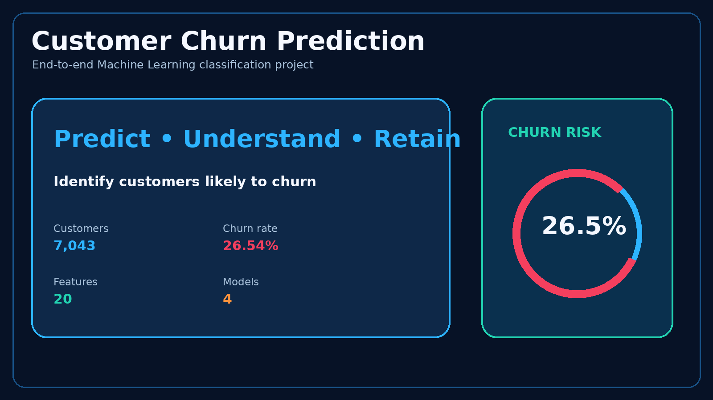
</p>

<h2 align="center">📉 Customer Churn Prediction</h2>

<p align="center">
  <b>Multi-Algorithm Classification Showdown</b><br>
  KNN • Naive Bayes • SVM • Decision Tree
</p>

<p align="center">


</p>

---

## 📌 Project Overview

Customer churn means a customer stops using a company's service or cancels their subscription.

For telecom companies, predicting churn can help identify customers who are likely to leave so that suitable retention actions can be taken before the customer actually leaves.

This project builds a complete **Machine Learning classification workflow** for customer churn prediction and compares multiple algorithms to determine which model performs best.

### 🎯 Main Objective

> **Predict whether a customer is likely to Churn or Stay and identify the model that provides the most useful classification performance.**

<p align="center">
  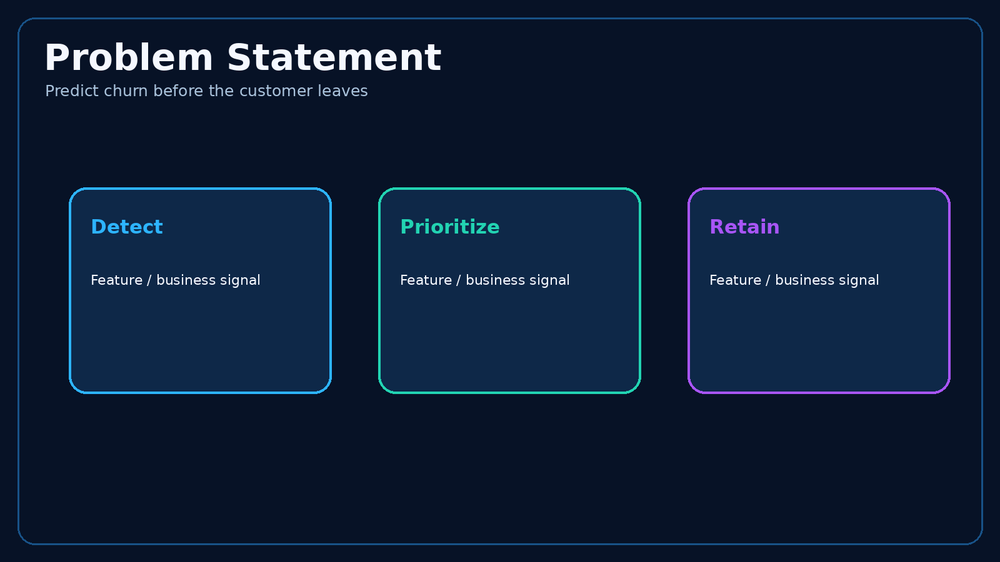
</p>

---

# 🎯 Business Problem

Telecom companies such as Jio and Airtel have to continuously retain existing customers.

Losing customers can affect:

* Customer Lifetime Value — **CLV**
* Revenue
* Retention performance
* Marketing efficiency
* Customer acquisition cost — **CAC**

The ML model helps identify potential churners so the business can focus retention efforts on customers who are more likely to leave.

<p align="center">
  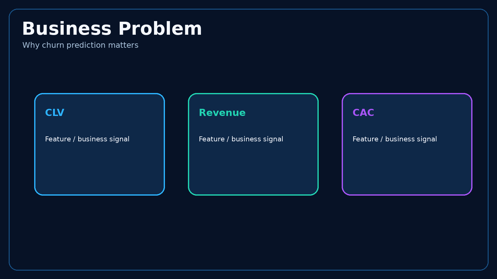
</p>

---

# 🔄 Project Workflow

<p align="center">
  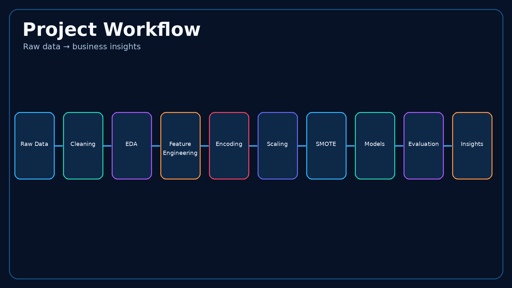
</p>

### Workflow

```text
Raw Customer Data
        ↓
Data Cleaning
        ↓
EDA & Analysis
        ↓
Feature Engineering
        ↓
Encoding
        ↓
Scaling
        ↓
Train / Test Split
        ↓
SMOTE on Training Data
        ↓
Model Training
        ↓
Hyperparameter Tuning
        ↓
Model Evaluation
        ↓
Model Comparison
        ↓
Business Insights
```

---

# 📊 Dataset

The project uses the **Telco Customer Churn dataset**.

The target variable is:

```text
Churn
```

### Target Classes

| Class | Meaning         |
| ----- | --------------- |
| `No`  | Customer stays  |
| `Yes` | Customer churns |

The dataset contains more **No-Churn customers than Churn customers**, creating a class imbalance problem.

---

# 🔍 Exploratory Data Analysis

EDA was performed to understand:

* Customer churn distribution
* Numerical features
* Categorical features
* Customer tenure
* Monthly charges
* Contract type
* Internet service
* Service usage
* Relationship between features and churn

<p align="center">
  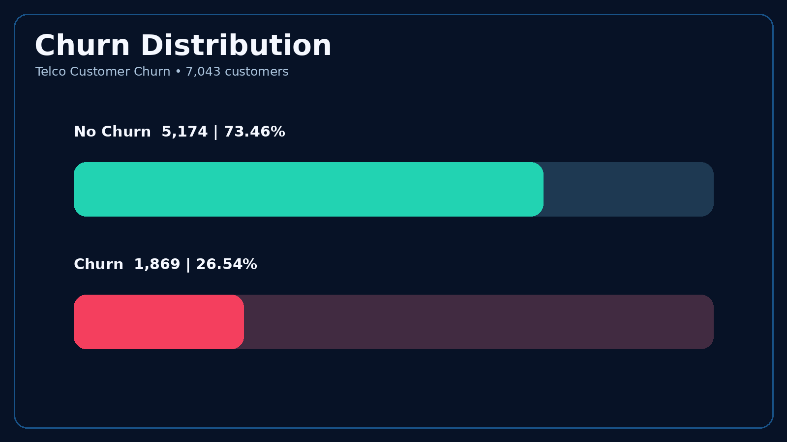
  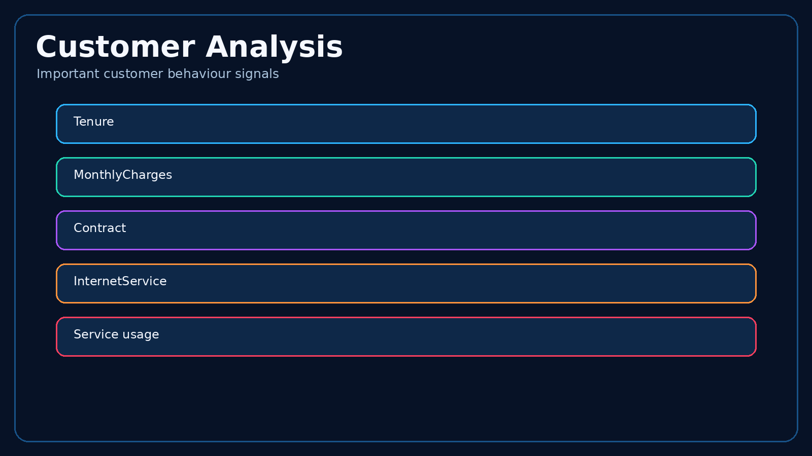
</p>

---

# 🧹 Data Preprocessing

Before training the models, the dataset was prepared through several preprocessing steps.

### Preprocessing Pipeline

```text
Missing Values
      ↓
Data Type Correction
      ↓
Duplicate / Data Quality Check
      ↓
Feature Engineering
      ↓
Categorical Encoding
      ↓
Numerical Scaling
      ↓
Train / Test Split
```

<p align="center">
  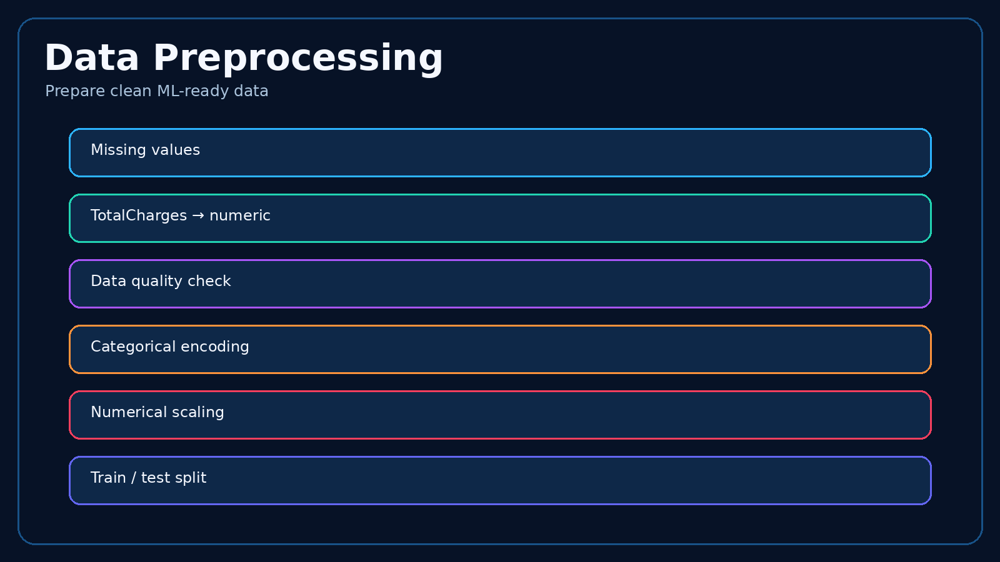
</p>

---

# 🛠️ Feature Engineering

Additional meaningful features were created to improve the model's understanding of customer behaviour.

### Example Features

| Feature        | Purpose                               |
| -------------- | ------------------------------------- |
| `tenure_group` | Groups customers based on tenure      |
| `num_services` | Number of services used               |
| `AutoPay`      | Indicates automatic payment behaviour |

<p align="center">
  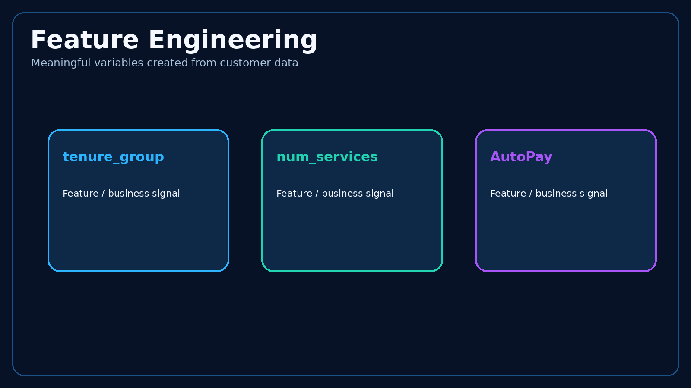
</p>

---

# ⚖️ Class Imbalance

The churn dataset is imbalanced because the number of **No-Churn customers is higher than Churn customers**.

If a model simply predicts the majority class, it can achieve reasonable accuracy while performing poorly on actual churners.

Therefore, class imbalance needs to be handled carefully.

---

# 🧬 SMOTE — Synthetic Minority Over-sampling Technique

SMOTE creates synthetic samples for the minority class using existing minority observations and their nearest neighbours.

### SMOTE Concept

```text
Minority Customer A
        \
         \ 
          → Synthetic Customer
         /
        /
Minority Customer B
```

<p align="center">
  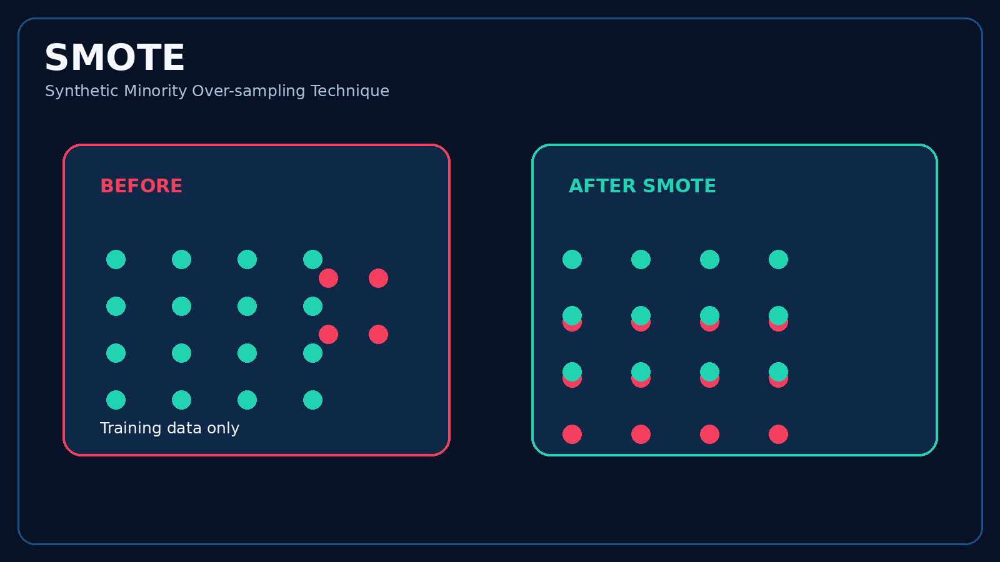
</p>

### ⚠️ Important Rule

**SMOTE is applied ONLY to the training data.**

The test data must remain untouched so that evaluation represents realistic unseen data.

---

# 🤖 Machine Learning Models

Four classification algorithms were implemented and compared.

---

## 1️⃣ K-Nearest Neighbours — KNN

KNN predicts a new customer using the **K most similar customers** from the training data.

The majority class among the nearest neighbours becomes the prediction.

<p align="center">
  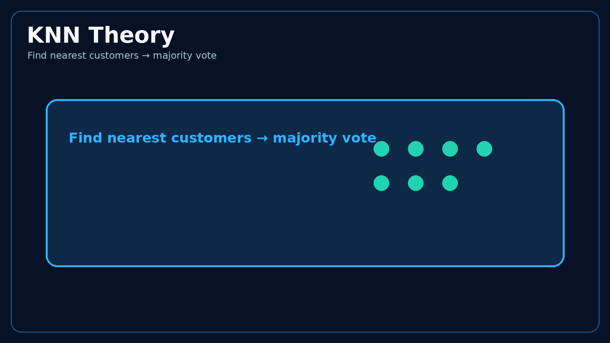
</p>

### Concept

```text
New Customer
      ↓
Find Nearest Customers
      ↓
Check Their Classes
      ↓
Majority Vote
      ↓
Churn / No Churn
```

---

# 2️⃣ Naive Bayes

Naive Bayes uses **Bayes' theorem** to calculate the probability of each class.

It assumes that features are conditionally independent given the class.

<p align="center">
  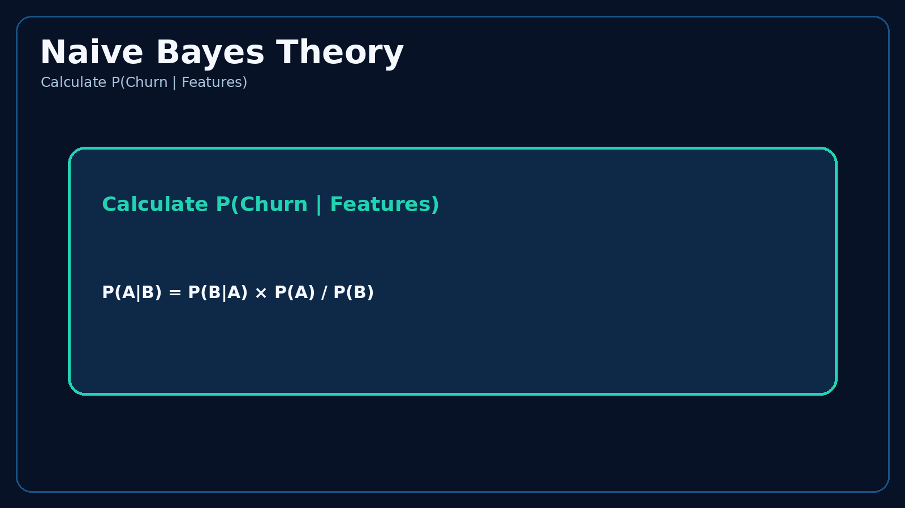
</p>

### Concept

```text
Customer Features
       ↓
Probability Calculation
       ↓
P(Churn | Features)
       ↓
P(No Churn | Features)
       ↓
Highest Probability
```

---

# 3️⃣ Support Vector Machine — SVM

SVM finds a decision boundary that separates classes while maximizing the margin between them.

An **RBF kernel** can model non-linear churn patterns.

<p align="center">
  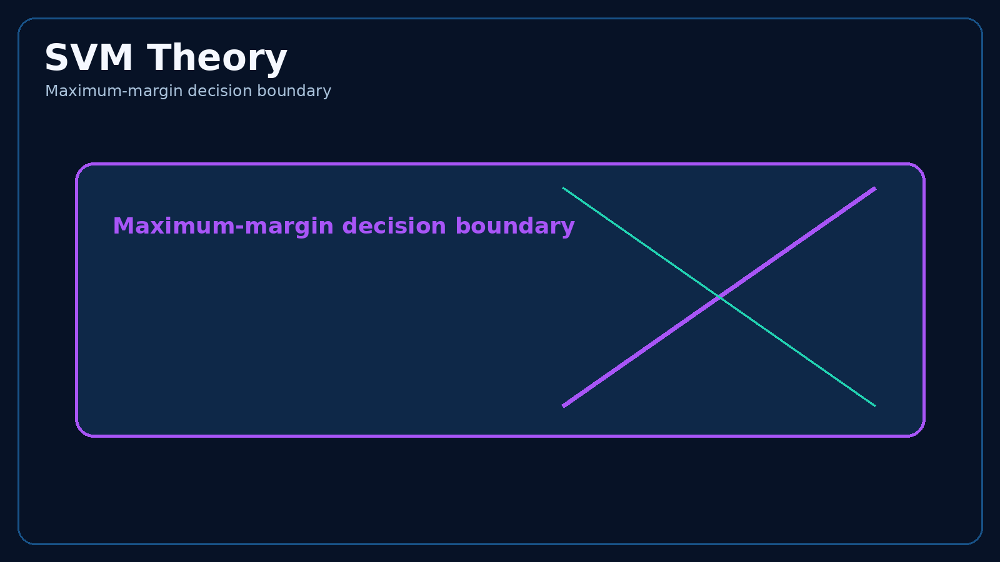
</p>

### Concept

```text
Customer Data
      ↓
Find Decision Boundary
      ↓
Maximize Margin
      ↓
Churn / No Churn
```

---

# 4️⃣ Decision Tree

Decision Tree repeatedly splits customers using feature-based rules.

The sequence of splits creates an interpretable tree that leads to a final prediction.

<p align="center">
  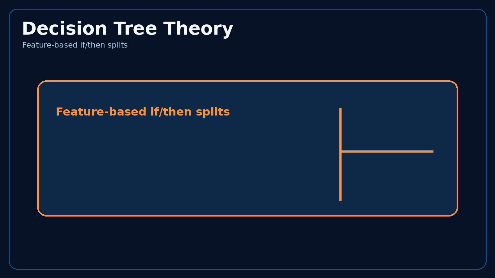
</p>

### Example

```text
Contract?
   │
   ├── Month-to-month
   │       ↓
   │   High Churn Risk
   │
   └── Long-term
           ↓
       Lower Risk
```

---

# 🎛️ Hyperparameter Tuning

Different hyperparameters were tested to find better-performing models.

### KNN

Different values of `K` were tested.

```text
K = 1
K = 3
K = 5
K = 7
K = 9
K = 11
K = 15
```

The best KNN configuration selected:

```text
Best K = 15
```

---

### SVM

Different values of `C` were tested:

```text
C = 0.1
C = 1
C = 10
C = 100
```

Best configuration:

```text
C = 100
```

---

### Decision Tree

Different tree depths were tested:

```text
3
4
5
6
7
8
None
```

Best configuration:

```text
max_depth = 4
```

<p align="center">
  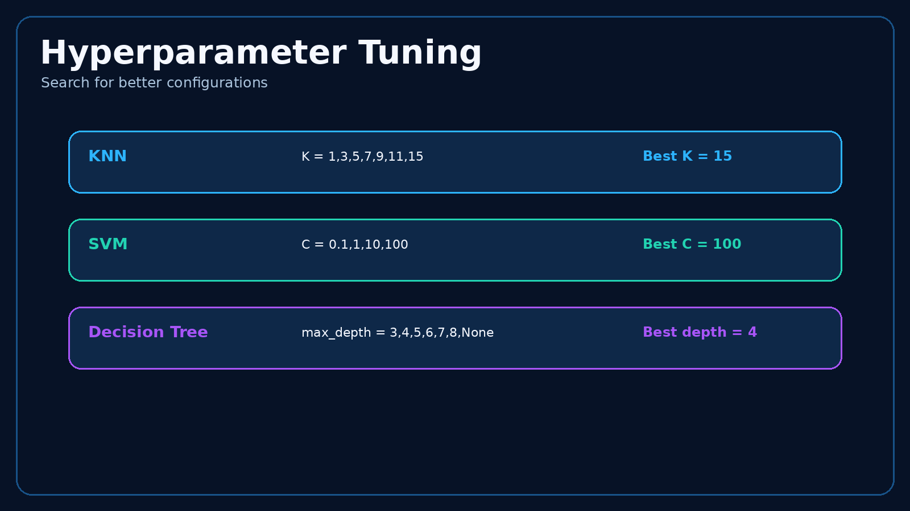
</p>

---

# 📈 Model Evaluation

The models were evaluated using:

### Accuracy

Overall percentage of correct predictions.

### Precision

Among customers predicted as churners, how many actually churned?

### Recall

Among actual churners, how many did the model correctly identify?

### F1 Score

Harmonic mean of Precision and Recall.

### ROC-AUC

Measures how well the model separates the two classes across different thresholds.

---

# 🏆 Model Comparison

| Model             |   Accuracy |  Precision |     Recall |   F1 Score |        AUC |
| ----------------- | ---------: | ---------: | ---------: | ---------: | ---------: |
| **KNN**           |     71.82% |     48.17% | **80.75%** |     60.34% |     81.58% |
| **Naive Bayes**   |     72.39% |     48.76% |     79.14% |     60.35% | **81.65%** |
| **SVM**           |     72.75% |     49.08% |     71.39% |     58.17% |     78.86% |
| **Decision Tree** | **74.38%** | **51.13%** |     78.34% | **61.88%** |     81.53% |

<p align="center">
  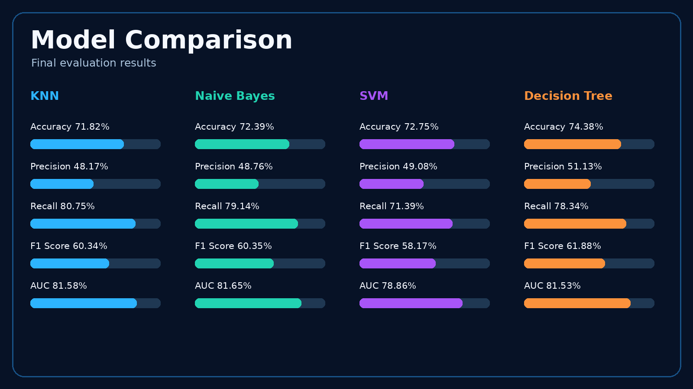
</p>

---

# 🥇 Best Performing Model

Based on the comparison:

### Decision Tree

Decision Tree achieved the highest:

* Accuracy — **74.38%**
* Precision — **51.13%**
* F1 Score — **61.88%**

It also achieved a strong Recall of:

### **78.34%**

---

# 🎯 Recall Analysis

For churn prediction, Recall is especially important when missing an actual churner can lead to lost future revenue and Customer Lifetime Value.

The theory material also highlights that:

> Recall becomes more important when the main objective is to catch as many real churners as possible.

### Recall Comparison

```text
KNN
████████████████ 80.75%

Naive Bayes
███████████████ 79.14%

Decision Tree
███████████████ 78.34%

SVM
██████████████  71.39%
```

<p align="center">
  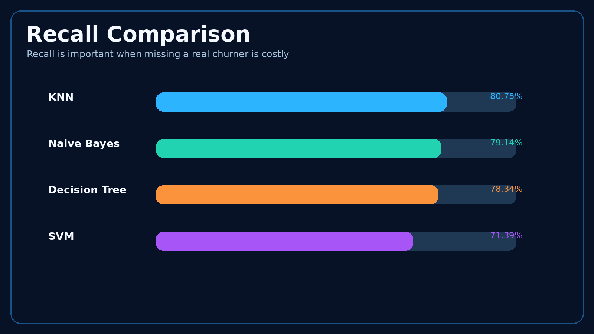
</p>

---

# 🧮 Confusion Matrix

A confusion matrix contains four important outcomes.

|                     | Predicted Churn | Predicted No Churn |
| ------------------- | --------------- | ------------------ |
| **Actual Churn**    | TP              | FN                 |
| **Actual No Churn** | FP              | TN                 |

### TP — True Positive

Actual churn and predicted churn.

### TN — True Negative

Actual stay and predicted stay.

### FP — False Positive

Actual stay but predicted churn.

The company may waste retention resources on these customers.

### FN — False Negative

Actual churn but predicted stay.

This is particularly costly because a real churner is missed and future revenue/CLV may be lost.

<p align="center">
  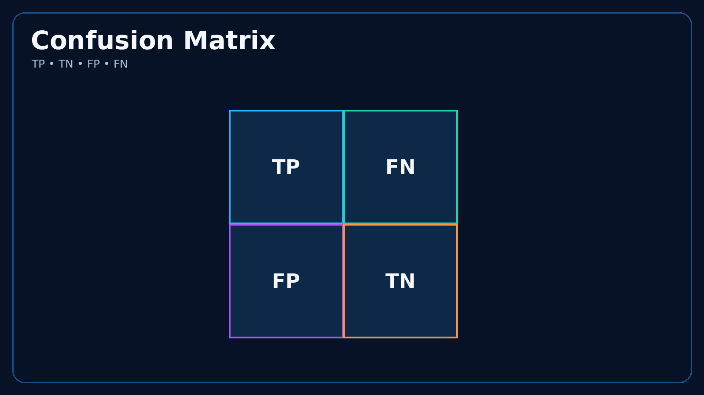
</p>

---

# 📉 ROC Curve & AUC

ROC curves were used to understand the trade-off between:

```text
True Positive Rate
        vs
False Positive Rate
```

AUC represents the overall ability of the model to distinguish between churn and no-churn customers.

<p align="center">
  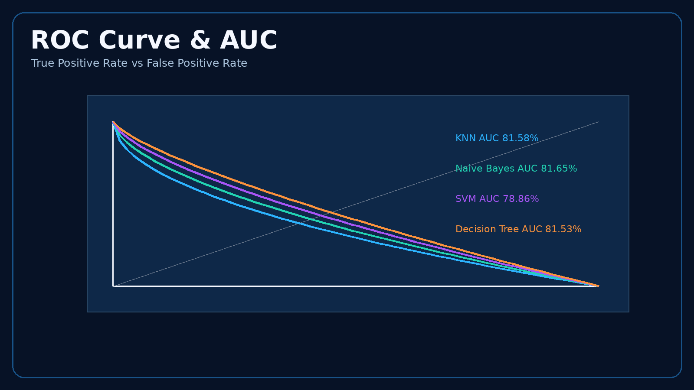
</p>

---

# 🚨 Error Analysis

Model errors can be divided into:

```text
False Positive
      ↓
Customer predicted as Churn
but actually stays

False Negative
      ↓
Customer predicted as Stay
but actually churns
```

### Business Perspective

**False Positive**

Retention team may spend:

* Discounts
* Offers
* Support resources

on customers who were actually going to stay.

**False Negative**

The company fails to identify a real churner and may lose:

* Future revenue
* Customer relationship
* Customer Lifetime Value

<p align="center">
  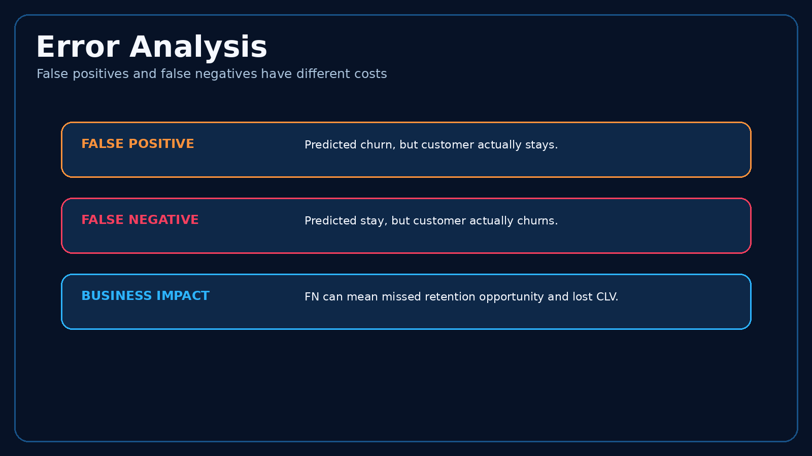
</p>

---

# 🔎 Feature Importance

The Decision Tree model helped identify important signals associated with churn prediction.

Important features included:

```text
Contract_Two year
Contract_One year
InternetService_Fiber optic
tenure
MonthlyCharges
```

<p align="center">
  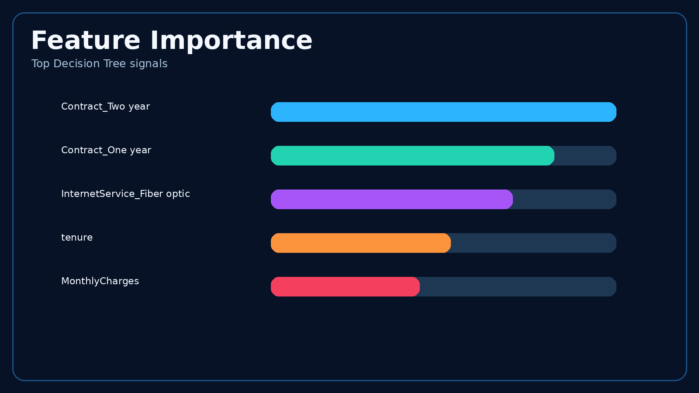
</p>

---

# 🎬 Project Walkthrough

<p align="center">
  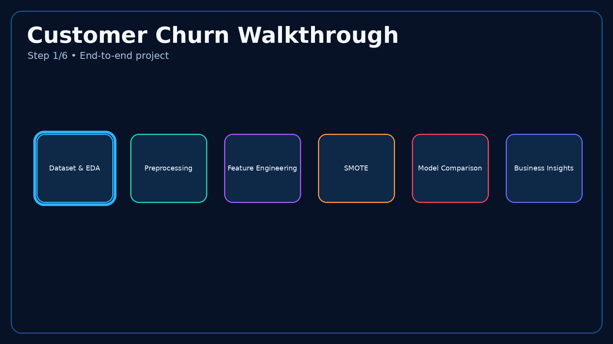
</p>

### Complete Process

```text
Dataset
   ↓
EDA
   ↓
Preprocessing
   ↓
Feature Engineering
   ↓
SMOTE
   ↓
KNN
   ↓
Naive Bayes
   ↓
SVM
   ↓
Decision Tree
   ↓
Evaluation
   ↓
Model Comparison
```

---

# 💡 Business Insights

### 1. Identify Potential Churners

The model can help identify customers who are more likely to leave.

### 2. Improve Retention

Businesses can focus retention campaigns on higher-risk customers.

### 3. Reduce Customer Loss

Early identification can provide an opportunity to take action before churn occurs.

### 4. Protect CLV

Retaining existing customers can help protect Customer Lifetime Value.

### 5. Control CAC

Keeping existing customers can reduce the need to repeatedly acquire replacement customers.

Customer churn prediction is valuable because customer acquisition involves marketing, sales and onboarding costs, while retained customers can generate revenue over a longer relationship.

---

# 🧠 Precision vs Recall — Business Decision

The correct metric depends on the business objective.

### Choose Recall when:

```text
Missing a churner is very expensive
                 ↓
        Catch more churners
                 ↓
             High Recall
```

### Choose Precision when:

```text
Retention action is expensive
                 ↓
Avoid unnecessary interventions
                 ↓
          High Precision
```

If False Positives are more costly, Precision becomes more important. If missing real churners is more costly, Recall becomes more important.

---

# 📚 Machine Learning Concepts Covered

This project combines multiple ML concepts:

```text
Classification
      │
      ├── KNN
      │
      ├── Naive Bayes
      │
      ├── SVM
      │
      └── Decision Tree

Data Preparation
      │
      ├── Missing Value Handling
      ├── Encoding
      ├── Scaling
      └── Feature Engineering

Imbalanced Learning
      │
      └── SMOTE

Model Evaluation
      │
      ├── Accuracy
      ├── Precision
      ├── Recall
      ├── F1 Score
      ├── Confusion Matrix
      └── ROC-AUC
```

---

# 🗂️ Project Structure

```text
Customer-Churn-Prediction/
│
├── assets/
│   │
│   ├── 01_hero_customer_churn.png
│   ├── 02_problem_statement.png
│   ├── 03_business_problem.png
│   ├── 04_project_workflow.png
│   ├── 05_churn_distribution.png
│   ├── 06_customer_analysis.png
│   ├── 07_data_preprocessing.png
│   ├── 08_feature_engineering.png
│   ├── 09_smote_explanation.png
│   ├── 10_knn_theory.png
│   ├── 11_naive_bayes_theory.png
│   ├── 12_svm_theory.png
│   ├── 13_decision_tree_theory.png
│   ├── 14_hyperparameter_tuning.png
│   ├── 15_model_comparison.png
│   ├── 16_recall_comparison.png
│   ├── 17_confusion_matrix.png
│   ├── 18_roc_curve.png
│   ├── 19_error_analysis.png
│   ├── 20_feature_importance.png
│   └── 21_customer_churn_walkthrough.gif
│
├── finalexam.ipynb
│
├── README.md
│
└── requirements.txt
```

---

# 🛠️ Technologies Used

| Technology          | Purpose                   |
| ------------------- | ------------------------- |
| 🐍 Python           | Programming               |
| 🐼 Pandas           | Data Manipulation         |
| 🔢 NumPy            | Numerical Computing       |
| 📊 Matplotlib       | Visualization             |
| 🎨 Seaborn          | Statistical Visualization |
| 🤖 Scikit-Learn     | Machine Learning          |
| ⚖️ Imbalanced-Learn | SMOTE                     |
| 📓 Jupyter Notebook | Development & Analysis    |
| 💻 VS Code          | Development               |
| 🐙 GitHub           | Version Control           |

---

# 📦 Installation

Clone the repository:

```bash
git clone https://github.com/pmanan2031-web/CUSTOMER-CHURN-PREDICTION.git
```

Move into the project folder:

```bash
cd CUSTOMER-CHURN-PREDICTION
```

Install dependencies:

```bash
pip install -r requirements.txt
```

Run Jupyter Notebook:

```bash
jupyter notebook
```

Open:

```text
finalexam.ipynb
```

---

# 📊 Final Results at a Glance

<p align="center">
  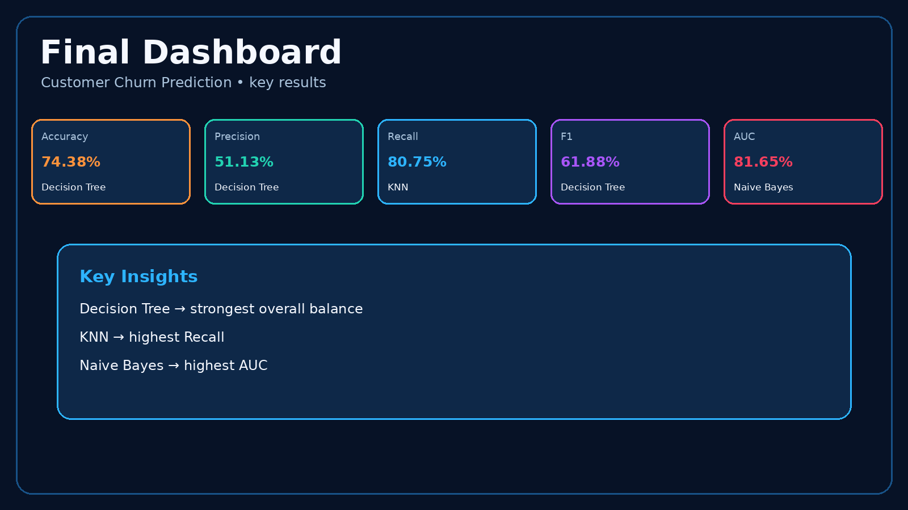
</p>

### 🏆 Model Highlights

| Metric    | Best Model    |      Score |
| --------- | ------------- | ---------: |
| Accuracy  | Decision Tree | **74.38%** |
| Precision | Decision Tree | **51.13%** |
| Recall    | KNN           | **80.75%** |
| F1 Score  | Decision Tree | **61.88%** |
| AUC       | Naive Bayes   | **81.65%** |

---

# 🎓 Viva / Interview Quick Revision

### What is Customer Churn?

Customer churn means a customer stops using a service or cancels their subscription.

### What is SMOTE?

SMOTE creates synthetic minority-class samples to help address class imbalance.

### Why only training data?

Because applying SMOTE to test data can cause data leakage and produce unrealistic evaluation.

### KNN?

**Neighbours and similarity.**

### Naive Bayes?

**Probability and Bayes theorem.**

### SVM?

**Maximum-margin decision boundary.**

### Decision Tree?

**Rules and feature-based splits.**

### FN?

Actual churn but predicted as stay.

### FP?

Actual stay but predicted as churn.

### Precision?

How many predicted churners were actually churners.

### Recall?

How many actual churners were correctly identified.

These core concepts match the project's theory notes.

---

# 🚀 Future Improvements

Possible future improvements include:

* Advanced hyperparameter optimization
* Threshold tuning
* More detailed customer segmentation
* Additional ensemble models
* Deployment-ready prediction interface
* Model monitoring
* Explainable ML

---

# 🏁 Conclusion

This project demonstrates an end-to-end **Customer Churn Prediction** workflow using multiple classification algorithms.

The project covers:

```text
EDA
 ↓
Data Preprocessing
 ↓
Feature Engineering
 ↓
SMOTE
 ↓
KNN
 ↓
Naive Bayes
 ↓
SVM
 ↓
Decision Tree
 ↓
Hyperparameter Tuning
 ↓
Evaluation
 ↓
Business Interpretation
```

Among the tested models, **Decision Tree achieved the strongest overall balance**, while **KNN achieved the highest Recall** and **Naive Bayes achieved the highest AUC** in the final comparison.

The project demonstrates how machine learning can transform customer data into actionable churn-risk insights.

---

# 👨‍💻 Author

### Manan

**Machine Learning • Data Analytics • Python • SQL • Power BI**

<p align="center">

⭐ If you found this project useful, consider giving the repository a star!

</p>

---

<p align="center">
  <b>📉 Predict Churn • 🎯 Identify Risk • 💡 Take Action</b>
</p>
